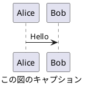

# CLAUDE.md

This file provides guidance to Claude Code (claude.ai/code) when working with code in this repository.

このファイルは、このリポジトリでコードを扱う際の Claude Code (claude.ai/code) への指針を提供します。

<important_rules>

性能改善やリファクタリングを要求された際は、オリジナルのソース解説コメントを維持してください。

**編集に関するルール**

編集を行う際は、編集の目的が精度向上であることを念頭において作業してください。
目的があいまいな場合は、以下のどの編集行為を行うとしているのか、ユーザーに問い合わせてください。

以下が一般的な編集です。

+ Polish: 仕上げの微調整、表現をなめらかにする
+ Refine: 不要部分を削り、精度を高める
+ Edit: 全般的な編集、誤字修正から大幅改変まで幅広い
+ Revise: 内容や構成を再検討して修正

以下の編集は、明確な書き直しや書き換えの指示がない限り、実施しないでください。

+ Rewrite: 大きく書き直す（意味も変わることあり）
+ Rephrase: 同じ意味を別の言い回しで表す
+ Reword: 特定の単語や表現を置き換える
+ Paraphrase: 意味を保ったまま言い換える

**単語の強制**

以下に示す単語は、同義語、同じ意味の他言語の単語に優先して使用すること。

+ Markdown

**表記に関するルール**

応答およびコードへのコメントの基本ルールは以下とする。

+ 本文の文末を `：` で終わらせないでください。きちんと文章として完結させてください。
+ 全角括弧 `（` `）` や全角コロン `：` は使用せず、半角 ` (` `) ` `: ` で記述してください。
+ 日本語と英単語の間は、半角スペースを挿入してください。
+ 見出し (#, ##, ...) と本文の間、および、本文とコードブロックの間は、空行を挿入してください。
+ 見出し (#, ##, ...) と見出し (#, ##, ...) の間に水平線 (`----`) を挿入しないでください。
+ 見出し (#, ##, ...) に続く文字列に番号 (1. など) を付与しないでください。
+ 絵文字の使用は最低限度の使用にしてください。シンプルな意味論を持つ絵文字として ✅, ❌, 🟢, 🟡, 🔴 などは許容します。
+ 特に言語の指定のないコードブロックの場合でも、'```text' のように形式を明示してください。

**図に関するルール**

ユーザーに図を提示する際は、原則として、PlantUML 形式としてください。  
plantuml コードブロックへのファイル名付与は不要です。  
PlantUML による記法では、`@startuml` と `caption` に同じタイトル文字列を付与してください。 `title` は使用しないでください。以下に例を示します。



PlantUML にてフローを説明する際は、アクティビティ図を優先してください。  
シーケンスに着目すべき内容の説明、および、シーケンス図を要求された場合は、シーケンス図としてください。  
適切であると判断された場合は、他の PlantUML 形式も活用してください。

PlantUML 形式での表現が困難な場合は、marmaid 形式としてください。  
marmaid による記法では、コードブロックの caption にタイトル文字列を付与してください。以下に例を示します。

```{.mermaid caption="Mermaid の図キャプション"}
sequenceDiagram
    Alice->>John: Hello John, how are you?
```

指示があった場合は、draw.io にインポート可能な xml の提示をしてください。  

</important_rules>

# setup.ps1 usage

setup.ps1 は、開発ツールのセットアップスクリプトです。packages フォルダから指定ディレクトリにバイナリを抽出、インストール、またはアンインストールを行います。

## 基本的な使用方法

```powershell
# 利用方法を表示
.\setup.ps1

# Extract: バイナリを抽出のみ
.\setup.ps1 -Extract

# Install: バイナリを抽出し、PATH環境変数に追加
.\setup.ps1 -Install

# Uninstall: インストールディレクトリを削除し、PATH環境変数からも削除
.\setup.ps1 -Uninstall

# カスタムインストール先を指定
.\setup.ps1 -Install -InstallDir "C:\Tools"
.\setup.ps1 -Extract -InstallDir ".\custom_bin"
.\setup.ps1 -Uninstall -InstallDir "C:\Tools"
```

## パラメーター

- `-Extract`: パッケージをインストールディレクトリに抽出します
- `-Install`: パッケージを抽出し、ユーザーのPATH環境変数に必要なディレクトリを追加します
- `-Uninstall`: インストールディレクトリを削除し、PATH環境変数から該当ディレクトリを削除します
- `-InstallDir <path>`: インストール先ディレクトリを指定します (デフォルト: `.\bin`)

# PATH 環境変数設定レポート

setup.ps1 -Install 実行時に自動的にPATH環境変数に追加されるディレクトリについて説明します。

## PATH に追加すべきディレクトリ

以下のディレクトリを PATH 環境変数に追加することで、インストールされた各ツールをコマンドラインから直接実行できます。

### 必須ディレクトリ

1. **`.\bin`** (メインディレクトリ)
   - Node.js (`node.exe`, `npm.cmd`, `npx.cmd`)
   - Pandoc (`pandoc.exe`)
   - pandoc-crossref (`pandoc-crossref.exe`)
   - PlantUML wrapper (`plantuml.cmd`)
   - Doxygen および doxybook2 の実行ファイル

2. **`.\bin\jdk-21\bin`**
   - Microsoft JDK の実行ファイル (`java.exe`, `javac.exe`, `jar.exe` など)

3. **`.\bin\python-3.13`**
   - Python embeddable package (`python.exe`, `pip.exe` など)

4. **`.\bin\git\bin`**
   - Portable Git のメイン実行ファイル (`git.exe` など)

5. **`.\bin\git\cmd`**
   - Git の Windows コマンド ラッパー

## 推奨設定順序

競合を避けるため、以下の順序で PATH に追加することを推奨します。

```text
.\bin
.\bin\jdk-21\bin
.\bin\python-3.13
.\bin\git\bin
.\bin\git\cmd
```

この順序により：
- メインツールが最優先で解決される
- Java → Python → Git の順で競合が解決される
- 各ツールの依存関係が適切に処理される

## 自動 PATH 設定

### Install オプション使用時

`.\setup.ps1 -Install` を実行すると、以下のディレクトリが自動的にユーザーのPATH環境変数に追加されます。

- 既存のPATHエントリとの重複チェック
- 適切な順序での追加
- エラー処理とフィードバック表示

### 手動 PATH 設定例 (Extract オプション使用時)

Extract オプションを使用した場合は、手動でPATH設定が必要です。

#### PowerShell での一時設定

```powershell
$env:PATH = ".\bin;.\bin\jdk-21\bin;.\bin\python-3.13;.\bin\git\bin;.\bin\git\cmd;" + $env:PATH
```

#### システム環境変数での永続設定

1. 「システム環境変数の編集」を開く
2. PATH 変数を選択して「編集」
3. 上記のディレクトリを適切な順序で追加

### カスタムインストールディレクトリの場合

`-InstallDir` オプションでカスタムディレクトリを指定した場合は、`.\bin` を指定したディレクトリに置き換えてください。

例：`.\setup.ps1 -Install -InstallDir "C:\Tools"` の場合、以下が自動的にPATHに追加されます：
```text
C:\Tools
C:\Tools\jdk-21\bin
C:\Tools\python-3.13
C:\Tools\git\bin
C:\Tools\git\cmd
```
