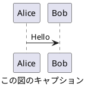

# CLAUDE.md

This file provides guidance to Claude Code (claude.ai/code) when working with code in this repository.

このファイルは、このリポジトリでコードを扱う際の Claude Code (claude.ai/code) への指針を提供します。

<important_rules>
性能改善やリファクタリングを要求された際は、オリジナルのソース解説コメントを維持してください。

**編集に関するルール**

編集を行う際は、編集の目的が精度向上であることを念頭において作業してください。
目的があいまいな場合は、以下のどの編集行為を行うとしているのか、ユーザーに問い合わせてください。

以下が一般的な編集です。

+ Polish: 仕上げの微調整、表現をなめらかにする
+ Refine: 不要部分を削り、精度を高める
+ Edit: 全般的な編集、誤字修正から大幅改変まで幅広い
+ Revise: 内容や構成を再検討して修正

以下の編集は、明確な書き直しや書き換えの指示がない限り、実施しないでください。

+ Rewrite: 大きく書き直す（意味も変わることあり）
+ Rephrase: 同じ意味を別の言い回しで表す
+ Reword: 特定の単語や表現を置き換える
+ Paraphrase: 意味を保ったまま言い換える

**単語の強制**

以下に示す単語は、同義語、同じ意味の他言語の単語に優先して使用すること。

+ Markdown

**表記に関するルール**

+ 本文の文末を `：` で終わらせないでください。きちんと文章として完結させてください。
+ 全角括弧 `（` `）` や全角コロン `：` は使用せず、半角で記述してください。
+ 日本語と英単語の間は、半角スペースを挿入してください。
+ 見出し (#, ##, ...) と本文の間、および、本文とコードブロックの間は、空行を挿入してください。
+ 見出し (#, ##, ...) と見出し (#, ##, ...) の間に水平線 (`----`) を挿入しないでください。
+ 見出し (#, ##, ...) に続く文字列に番号 (1. など) を付与しないでください。
+ 絵文字の使用は最低限度の使用にしてください。シンプルな意味論を持つ絵文字として ✅, ❌, 🟢, 🟡, 🔴 などは許容します。
+ 特に言語の指定のないコードブロックの場合でも、'```text' のように形式を明示してください。

**図に関するルール**

ユーザーに図を提示する際は、原則として、PlantUML 形式としてください。  
plantuml コードブロックへのファイル名付与は不要です。  
PlantUML による記法では、`@startuml` と `caption` に同じタイトル文字列を付与してください。 `title` は使用しないでください。以下に例を示します。



PlantUML にてフローを説明する際は、アクティビティ図を優先してください。  
シーケンスに着目すべき内容の説明、および、シーケンス図を要求された場合は、シーケンス図としてください。  
適切であると判断された場合は、他の PlantUML 形式も活用してください。

PlantUML 形式での表現が困難な場合は、marmaid 形式としてください。  
marmaid による記法では、コードブロックの caption にタイトル文字列を付与してください。以下に例を示します。

```{.mermaid caption="Mermaid の図キャプション"}
sequenceDiagram
    Alice->>John: Hello John, how are you?
```

指示があった場合は、draw.io にインポート可能な xml の提示をしてください。  
</important_rules>
