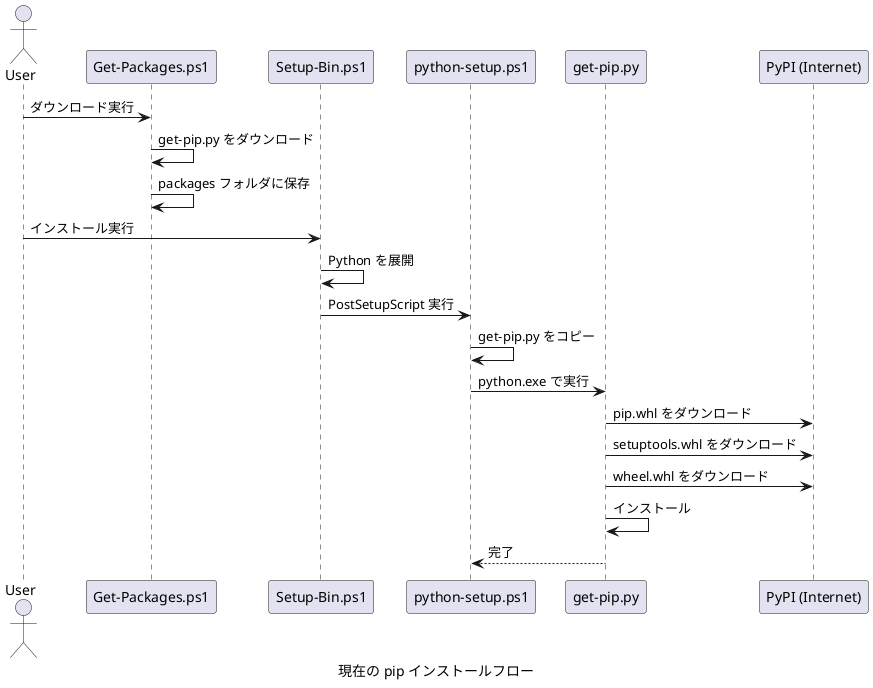
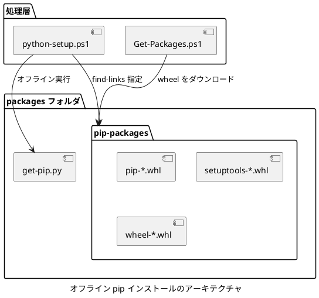
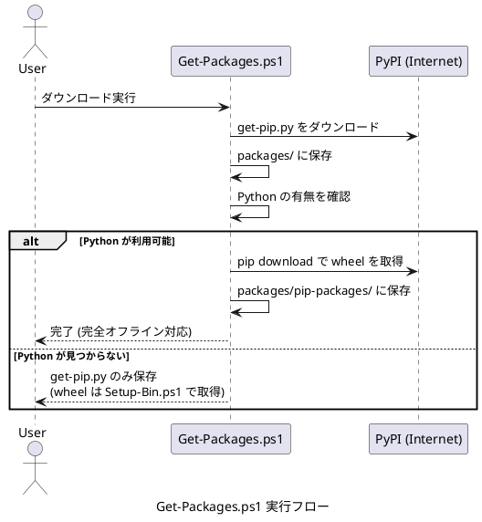
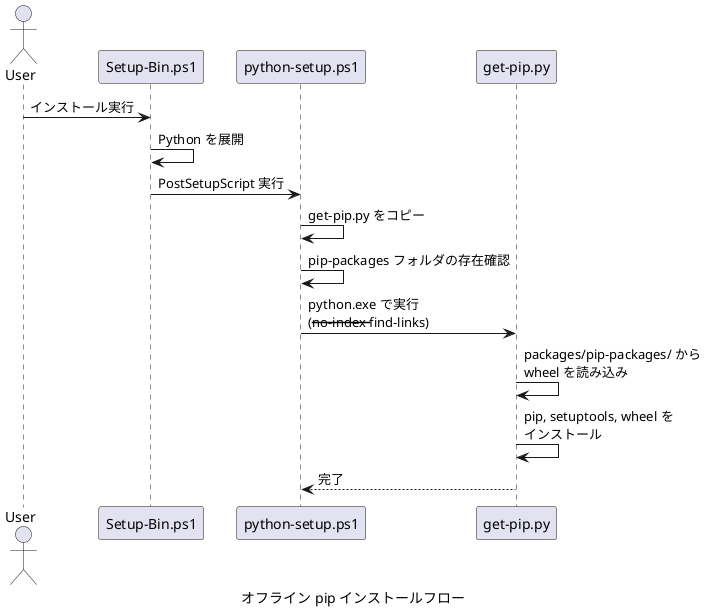
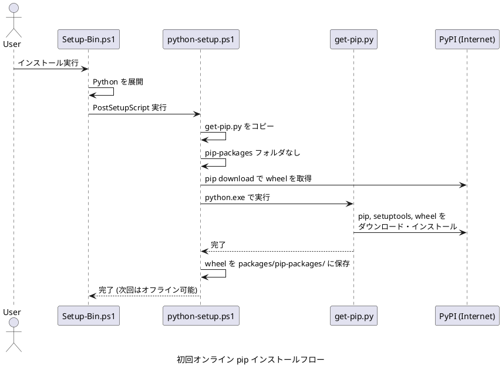

# オフライン pip インストール設計書

## 概要

本文書では、完全オフライン環境での pip インストールを実現するための仕様拡張について説明します。

get-pip.py は通常、実行時にインターネットから pip、setuptools、wheel などの wheel ファイルをダウンロードしてインストールします。この設計では、これらの wheel ファイルを事前に別マシンでダウンロードし、packages フォルダに格納することで、完全オフライン環境での pip インストールを可能にします。

## 現状の実装

### 現在の動作フロー



### 問題点

現在の実装では、get-pip.py の実行時にインターネット接続が必要です。完全オフライン環境では pip のインストールができません。

## 設計方針

### 基本アプローチ

get-pip.py の `--no-index` および `--find-links` オプションを使用して、ローカルの wheel ファイルから pip をインストールします。

```bash
python get-pip.py --no-index --find-links=./pip-packages
```

このアプローチにより、以下の利点があります。

- 現在の実装への変更が最小限
- get-pip.py の標準的な機能を活用
- 依存関係の解決を get-pip.py に委譲できる

### アーキテクチャ



## 実装仕様

### Get-Packages.ps1 の拡張

Get-Packages.ps1 に wheel ファイル自動ダウンロード機能を追加します。

```powershell
# get-pip.py のダウンロード後に wheel ファイルをダウンロード
function Download-PipWheels {
    param(
        [string]$PackagesDir
    )

    # Python が利用可能かを確認
    $pythonExe = Get-Command python.exe -ErrorAction SilentlyContinue
    if (-not $pythonExe) {
        Write-Host "Python not found. Skipping wheel download."
        Write-Host "Wheel files will be downloaded during Setup-Bin.ps1 execution."
        return
    }

    Write-Host "Python found. Downloading pip wheel files..."

    $pipPackagesDir = Join-Path $PackagesDir "pip-packages"
    if (!(Test-Path $pipPackagesDir)) {
        New-Item -ItemType Directory -Path $pipPackagesDir -Force | Out-Null
    }

    try {
        # pip download で wheel ファイルを取得
        & $pythonExe -m pip download pip setuptools wheel --dest $pipPackagesDir --no-deps

        if ($LASTEXITCODE -eq 0) {
            Write-Host "Successfully downloaded wheel files to $pipPackagesDir"
        } else {
            Write-Host "Warning: Failed to download some wheel files (exit code: $LASTEXITCODE)"
        }
    } catch {
        Write-Host "Warning: Failed to download wheel files: $($_.Exception.Message)"
    }
}

# get-pip.py のダウンロード後に実行
Download-PipWheels -PackagesDir $packagesDir
```

### python-setup.ps1 の拡張

packages/pip-packages フォルダが存在する場合、get-pip.py を `--no-index --find-links` オプション付きで実行します。

オンラインインストール時にダウンロードされた wheel ファイルは、次回のオフライン利用のために packages/pip-packages フォルダに保存します。

```powershell
# pip をインストール
Write-Host "Installing pip..."
$pythonExe = Join-Path $TargetPath "python.exe"
if (Test-Path $pythonExe) {
    try {
        # pip-packages フォルダが存在する場合はオフラインインストール
        $pipPackagesDir = "packages\pip-packages"
        $offlineMode = Test-Path $pipPackagesDir

        if ($offlineMode) {
            Write-Host "Using offline installation with local wheel files..."
            $pipPackagesAbsPath = (Resolve-Path $pipPackagesDir).Path
            & $pythonExe $getPipDestination --no-warn-script-location `
                --no-index --find-links=$pipPackagesAbsPath
        } else {
            Write-Host "Using online installation (downloading from PyPI)..."

            # 一時ディレクトリに wheel をダウンロード
            $tempDir = Join-Path ([System.IO.Path]::GetTempPath()) "devbin-pip-wheels"
            New-Item -ItemType Directory -Path $tempDir -Force | Out-Null

            # pip download で wheel ファイルを取得
            & $pythonExe -m pip download pip setuptools wheel --dest $tempDir --no-deps 2>$null

            # get-pip.py で通常インストール
            & $pythonExe $getPipDestination --no-warn-script-location

            # ダウンロードした wheel を packages/pip-packages に保存
            if (Test-Path $tempDir) {
                New-Item -ItemType Directory -Path $pipPackagesDir -Force | Out-Null
                Copy-Item -Path "$tempDir\*.whl" -Destination $pipPackagesDir -Force
                Write-Host "Saved wheel files to $pipPackagesDir for future offline use"
                Remove-Item -Path $tempDir -Recurse -Force
            }
        }

        if ($LASTEXITCODE -eq 0) {
            Write-Host "pip installed successfully"
        } else {
            Write-Host "Warning: pip installation may have issues (exit code: $LASTEXITCODE)"
        }
    } catch {
        Write-Host "Warning: Failed to install pip: $($_.Exception.Message)"
    } finally {
        # 環境変数をクリーンアップ
        Remove-Item Env:PYTHONHOME -ErrorAction SilentlyContinue
        Remove-Item Env:PYTHONPATH -ErrorAction SilentlyContinue
    }
} else {
    Write-Host "Warning: python.exe not found, skipping pip installation"
}
```

## オフラインパッケージの準備方法

### Get-Packages.ps1 による自動ダウンロード

Get-Packages.ps1 は、wheel ファイルを自動的にダウンロードする機能を持ちます。

```powershell
# Get-Packages.ps1 の実行
.\Get-Packages.ps1
```

動作フロー

1. get-pip.py をダウンロード
2. Python が利用可能かを確認
   - Python が見つかった場合: `pip download` で wheel ファイルをダウンロードし、packages フォルダに配置
   - Python が見つからない場合: get-pip.py のダウンロードのみ実施。wheel ファイルは Setup-Bin.ps1 実行時に取得

この仕組みにより、以下のシナリオに対応します。

- **Python がインストール済みの環境**: Get-Packages.ps1 実行時に wheel ファイルを事前取得し、完全オフライン対応
- **Python が未インストールの環境**: Setup-Bin.ps1 で Python をインストール後、初回オンライン実行時に wheel ファイルを自動保存

### 手動での wheel ファイル取得方法

Get-Packages.ps1 を使わず、別マシンで以下のコマンドを実行し、最新の wheel ファイルを直接 packages/pip-packages にダウンロードすることもできます。

```bash
# pip パッケージのダウンロード
pip download pip setuptools wheel --dest packages/pip-packages --no-deps

# または特定のバージョンを指定
pip download pip==25.3 setuptools==80.9.0 wheel==0.45.1 --dest packages/pip-packages --no-deps
```

```text
packages/
├─ pip-packages/
│  ├─ pip-25.3-py3-none-any.whl
│  ├─ setuptools-80.9.0-py3-none-any.whl
│  └─ wheel-0.45.1-py3-none-any.whl
└─ get-pip.py
```

## 動作フロー

### Get-Packages.ps1 実行フロー



### オフライン環境でのインストールフロー (wheel ファイルあり)



### 初回オンライン実行フロー (wheel ファイルなし)



### 処理の詳細

#### Get-Packages.ps1

1. 各パッケージのダウンロード (get-pip.py など)
2. Python の利用可否を確認
   - `Get-Command python.exe` で確認
3. Python が利用可能な場合
   - `pip download pip setuptools wheel` で wheel ファイルをダウンロード
   - packages/pip-packages フォルダに直接保存
4. Python が見つからない場合
   - get-pip.py のみダウンロード
   - wheel ファイルは Setup-Bin.ps1 実行時に取得

#### Setup-Bin.ps1

1. packages.psd1 を読み込む
2. 各パッケージを処理
   - Python を展開
   - python-setup.ps1 を実行

#### python-setup.ps1

1. get-pip.py を Python ディレクトリにコピー
2. packages/pip-packages フォルダの存在を確認
3. オフラインモードまたはオンラインモードで pip をインストール
   - オフライン: `python get-pip.py --no-index --find-links=packages/pip-packages`
   - オンライン: `pip download` で wheel を取得後、`python get-pip.py` を実行
4. オンライン実行時は wheel ファイルを packages/pip-packages に保存
   - 次回実行時はオフラインインストールが可能になる

## 互換性と移行

### 後方互換性

この設計は後方互換性を保持します。

- packages/pip-packages フォルダが存在しない場合、従来通りオンラインインストールが実行されます
- wheel ファイルが packages フォルダに存在しない場合、PipWheel 戦略は警告を出力してスキップされます

### 移行手順

既存のユーザーが完全オフライン環境に移行する手順を示します。

#### 推奨手順 (Get-Packages.ps1 を利用)

1. インターネット接続のあるマシンで Get-Packages.ps1 を実行
   - Python がインストール済みの場合、wheel ファイルが自動的にダウンロードされる
2. packages フォルダ全体をオフライン環境にコピー
3. オフライン環境で Setup-Bin.ps1 を実行

#### 手動手順 (Python が未インストールの場合)

1. インターネット接続のあるマシンで Get-Packages.ps1 を実行
   - get-pip.py のみダウンロードされる
2. packages フォルダ全体をオフライン環境にコピー
3. オフライン環境で Setup-Bin.ps1 を初回実行
   - オンライン接続がある場合、wheel ファイルが自動的に取得・保存される
4. 以降はオフラインインストールが可能

## 拡張性

### 追加パッケージのサポート

将来的に、pip でインストールする Python パッケージを事前にダウンロードしてオフラインインストールすることも可能です。

```bash
# 追加パッケージのダウンロード (依存関係を含む)
pip download requests --dest packages/pip-packages
```

packages/pip-packages フォルダに配置すれば、以下のコマンドでオフラインインストールできます。

```bash
pip install requests --no-index --find-links=packages/pip-packages
```

### 自動化スクリプト

wheel ファイルの一括ダウンロードスクリプトを提供することで、運用を簡素化できます。

```powershell
# Download-PipWheels.ps1 (将来的な拡張)
param(
    [string]$OutputDir = "packages\pip-packages"
)

$packages = @(
    "pip==25.3",
    "setuptools==80.9.0",
    "wheel==0.45.1"
)

foreach ($pkg in $packages) {
    pip download $pkg --dest $OutputDir --no-deps
}
```

## まとめ

本設計により、以下を実現します。

- 完全オフライン環境での pip インストール
- 既存の実装への影響を最小化
- get-pip.py の標準的な機能を活用
- 後方互換性の保持
- 将来的な拡張性の確保

Get-Packages.ps1 と python-setup.ps1 を拡張することで、オフライン環境でも pip を確実にインストールできるようになります。

### 自動化による利便性

- **Get-Packages.ps1**: Python が利用可能な場合、wheel ファイルを自動ダウンロード
- **python-setup.ps1**: オンライン実行時に wheel ファイルを自動保存し、次回オフライン実行を可能にする

この二段構えのアプローチにより、ユーザーは手動での wheel ファイル管理を意識することなく、柔軟にオンライン・オフライン環境を切り替えて利用できます。
