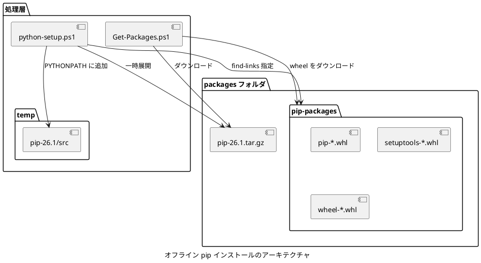
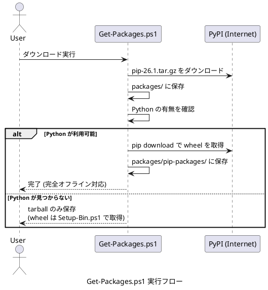
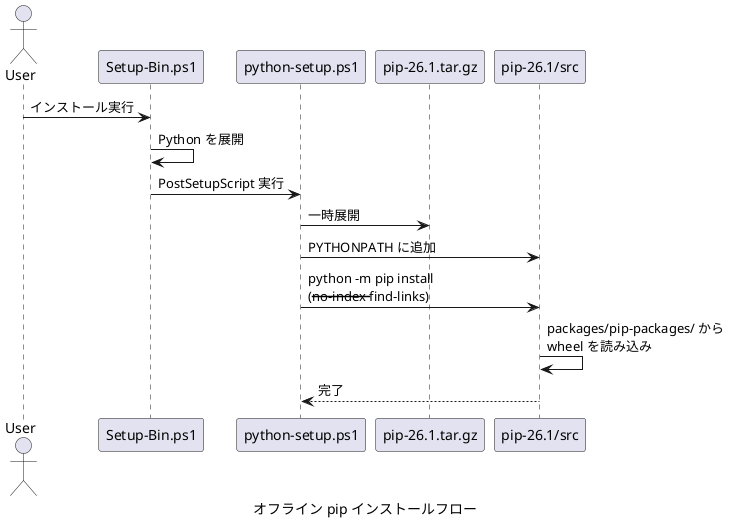
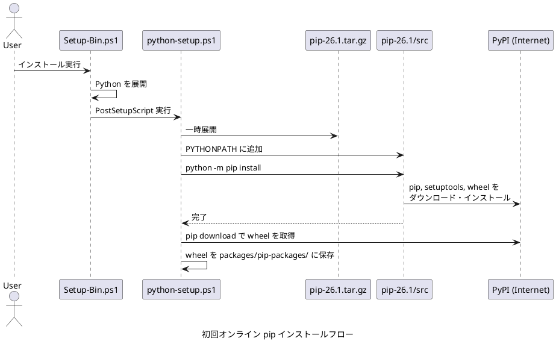

# オフライン pip インストール設計書

## 概要

本文書では、完全オフライン環境での pip インストールを実現するための実装方針を説明します。

pip 本体として PyPI の source tarball `pip-26.1.tar.gz` を取得します。`python-setup.ps1` はこの tarball を一時展開し、`src` ディレクトリを `PYTHONPATH` に追加した状態で `python -m pip` を実行します。pip、setuptools、wheel の wheel ファイルは `packages/pip-packages` に保存し、オフラインインストールに利用します。

## 採用理由

この方式により、以下を両立できます。

- pip 本体の依存解決とインストール処理は引き続き pip 自身に委譲できる
- インストール後も標準的な `python -m pip` ベースで利用できる

## アーキテクチャ


```plantuml
@startuml オフライン pip インストールのアーキテクチャ
caption オフライン pip インストールのアーキテクチャ
package "packages フォルダ" {
  [pip-26.1.tar.gz]
  folder "pip-packages" {
    [pip-*.whl]
    [setuptools-*.whl]
    [wheel-*.whl]
  }
}

package "処理層" {
  [Get-Packages.ps1] as getpkg
  [python-setup.ps1] as pysetup
  folder "temp" {
    [pip-26.1/src]
  }
}

getpkg --> [pip-26.1.tar.gz] : ダウンロード
getpkg --> [pip-packages] : wheel をダウンロード
pysetup --> [pip-26.1.tar.gz] : 一時展開
pysetup --> [pip-26.1/src] : PYTHONPATH に追加
pysetup --> [pip-packages] : find-links 指定
@enduml
```

## 実装仕様

### packages.psd1

`get-pip` パッケージは、以下の定義で `pip-26.1.tar.gz` を保持します。

```powershell
@{
    Name = "pip source tarball"
    ShortName = "get-pip"
    Version = "26.1"
    ArchivePattern = "^pip-26\.1\.tar\.gz$"
    ExtractStrategy = "CopyToPackages"
    DownloadUrl = "https://files.pythonhosted.org/packages/73/7e/d2b04004e1068ad4fdfa2f227b839b5d03e602e47cdbbf49de71137c9546/pip-26.1.tar.gz"
    Hidden = $true
}
```

### Get-Packages.ps1

`Get-Packages.ps1` は以下を行います。

1. `pip-26.1.tar.gz` を `packages` にダウンロード
2. Python が利用可能なら `pip download pip setuptools wheel --dest packages/pip-packages --no-deps` を実行

### python-setup.ps1

`python-setup.ps1` は以下を行います。

1. 埋め込み Python の `._pth` を更新し、`Lib\site-packages` と `import site` を有効化
2. `packages\pip-*.tar.gz` を検出
3. tarball を一時ディレクトリへ展開
4. 展開先の `pip-26.1\src` を `PYTHONPATH` に追加
5. `python -m pip install ...` を実行
6. オンライン時は追加で wheel を `packages/pip-packages` に保存
7. `PYTHONHOME` / `PYTHONPATH` と一時展開ディレクトリを cleanup

実行コマンドは以下の 2 系統です。

```bash
# オフライン
python -m pip install --no-index --find-links=packages/pip-packages pip setuptools wheel

# オンライン
python -m pip install pip setuptools wheel
```

## 動作フロー

### Get-Packages.ps1 実行フロー


```plantuml
@startuml Get-Packages.ps1 実行フロー
caption Get-Packages.ps1 実行フロー
actor User
participant "Get-Packages.ps1" as GetPkg
participant "PyPI (Internet)" as PyPI

User -> GetPkg: ダウンロード実行
GetPkg -> PyPI: pip-26.1.tar.gz をダウンロード
GetPkg -> GetPkg: packages/ に保存
GetPkg -> GetPkg: Python の有無を確認

alt Python が利用可能
    GetPkg -> PyPI: pip download で wheel を取得
    GetPkg -> GetPkg: packages/pip-packages/ に保存
    GetPkg --> User: 完了 (完全オフライン対応)
else Python が見つからない
    GetPkg --> User: tarball のみ保存\n(wheel は Setup-Bin.ps1 で取得)
end
@enduml
```

### オフライン環境でのインストールフロー


```plantuml
@startuml オフライン pip インストールフロー
caption オフライン pip インストールフロー
actor User
participant "Setup-Bin.ps1" as Setup
participant "python-setup.ps1" as PySetup
participant "pip-26.1.tar.gz" as PipSrc
participant "pip-26.1/src" as PipModule

User -> Setup: インストール実行
Setup -> Setup: Python を展開
Setup -> PySetup: PostSetupScript 実行
PySetup -> PipSrc: 一時展開
PySetup -> PipModule: PYTHONPATH に追加
PySetup -> PipModule: python -m pip install\n(--no-index --find-links)
PipModule -> PipModule: packages/pip-packages/ から\nwheel を読み込み
PipModule --> PySetup: 完了
@enduml
```

### 初回オンライン実行フロー


```plantuml
@startuml 初回オンライン pip インストールフロー
caption 初回オンライン pip インストールフロー
actor User
participant "Setup-Bin.ps1" as Setup
participant "python-setup.ps1" as PySetup
participant "pip-26.1.tar.gz" as PipSrc
participant "pip-26.1/src" as PipModule
participant "PyPI (Internet)" as PyPI

User -> Setup: インストール実行
Setup -> Setup: Python を展開
Setup -> PySetup: PostSetupScript 実行
PySetup -> PipSrc: 一時展開
PySetup -> PipModule: PYTHONPATH に追加
PySetup -> PipModule: python -m pip install
PipModule -> PyPI: pip, setuptools, wheel を\nダウンロード・インストール
PipModule --> PySetup: 完了
PySetup -> PyPI: pip download で wheel を取得
PySetup -> PySetup: wheel を packages/pip-packages/ に保存
@enduml
```

## 運用

### オフラインパッケージの準備

1. インターネット接続のある環境で `Get-Packages.ps1` を実行
2. `packages` フォルダごとオフライン環境へコピー
3. オフライン環境で `Install-Bin.cmd` を実行

Python が利用可能な環境では、`Get-Packages.ps1` 実行時点で wheel まで揃うため、そのまま完全オフライン導入に使えます。

### 手動での wheel 取得

```bash
pip download pip setuptools wheel --dest packages/pip-packages --no-deps
```

```text
packages/
├─ pip-packages/
│  ├─ pip-26.1-py3-none-any.whl
│  ├─ setuptools-*.whl
│  └─ wheel-*.whl
└─ pip-26.1.tar.gz
```

## まとめ

本設計では、`Get-Packages.ps1` が source tarball と wheel を準備し、`python-setup.ps1` は一時展開した `src` から `python -m pip` を実行します。これにより、PyPI を正本とした完全オフライン pip 導入を実現します。
