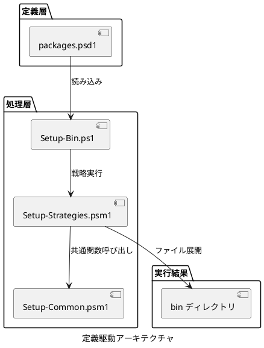
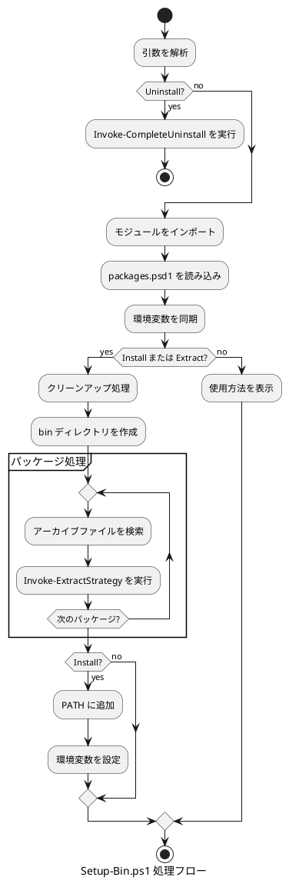

# Setup-Bin.ps1 設計書

## 概要

本文書では、subscripts/Setup-Bin.ps1 の定義駆動アーキテクチャについて説明します。

パッケージの特徴を定義データとして表現し、汎用的な処理エンジンで扱うアプローチを採用しています。これにより、新規パッケージの追加が定義ファイルへの記述のみで完結し、保守性と拡張性が大幅に向上しています。

## アーキテクチャ概要

### ディレクトリ構造

```text
subscripts/
├─ Setup-Bin.ps1 (メインスクリプト)
├─ Setup-Common.psm1 (共通関数モジュール)
├─ Setup-Strategies.psm1 (抽出戦略の実装)
├─ Setup-Bin.legacy.ps1 (旧実装、参照用)
└─ config/
   ├─ packages.psd1 (パッケージ定義)
   └─ templates/
      └─ python-setup.ps1 (Python 用セットアップスクリプト)
```

### 定義駆動アーキテクチャ



## パッケージ定義ファイル (packages.psd1)

パッケージ定義ファイルの詳細については、[packages-psd1-specification.md](./packages-psd1-specification.md) を参照してください。

### 概要

すべてのパッケージ情報を PowerShell データファイル (.psd1) 形式で一元管理します。パッケージの定義情報を宣言的に記述することで、コードを変更せずに新しいパッケージを追加できます。

## 抽出戦略 (Extract Strategy)

抽出戦略の詳細については、[extract-strategies-specification.md](./extract-strategies-specification.md) を参照してください。

### 概要

Setup-Strategies.psm1 に実装された抽出パターンです。各戦略は特定の展開方法を表します。

### 戦略一覧

| 戦略名 | 説明 | 対象パッケージ |
|--------|------|---------------|
| Standard | ZIP を展開し、すべてを bin に配置 | Node.js, Pandoc, Doxygen |
| Subdirectory | 特定のサブディレクトリのみ抽出 | nkf, CMake, GNU Make, innoextract |
| SubdirectoryToTarget | サブディレクトリをターゲットディレクトリに抽出 | Graphviz |
| VersionNormalized | バージョン番号を正規化 | JDK, Python |
| TargetDirectory | 指定ディレクトリに展開 | .NET SDK, VS Code |
| JarWithWrapper | JAR + cmd ラッパー生成 | PlantUML |
| SingleExecutable | 単一実行ファイルをコピー | NuGet |
| SelfExtractingArchive | 自己解凍実行ファイルを実行 | Portable Git |
| InnoSetup | innoextract で Inno Setup インストーラを解凍 | OpenCppCoverage |
| VSBuildTools | Visual Studio Build Tools のセットアップ | VSBT |

## 共通関数モジュール (Setup-Common.psm1)

### 概要

複数のスクリプトで共有される汎用的な関数を提供します。

### 主要関数

#### パス管理

- `Add-ToUserPath`: ユーザー PATH にディレクトリを追加
- `Remove-FromUserPath`: ユーザー PATH からディレクトリを削除

#### 環境変数管理

- `Sync-EnvironmentVariable`: レジストリから環境変数を同期
- `Sync-EnvironmentVariables`: 複数の環境変数を一括同期

#### ファイル操作

- `Convert-ToLongPath`: 長いパスを UNC 形式に変換
- `New-LongPathDirectory`: 長いパス対応のディレクトリ作成
- `Copy-LongPathFile`: 長いパス対応のファイルコピー

#### VS Code データ管理

- `Backup-VSCodeData`: VS Code data フォルダのバックアップ
- `Restore-VSCodeData`: VS Code data フォルダの復元

#### アンインストール

- `Invoke-CompleteUninstall`: 完全アンインストール処理

## メインスクリプト (Setup-Bin.ps1)

### 概要

パッケージ定義を読み込み、抽出戦略を実行するメインスクリプトです。

### 処理フロー



### 主要機能

#### パッケージ処理

```powershell
foreach ($packageConfig in $Packages) {
    $packageName = $packageConfig.Name
    $archivePattern = $packageConfig.ArchivePattern

    # packages フォルダ内でアーカイブファイルを検索
    $archiveFiles = Get-ChildItem -Path $packagesDir -File |
        Where-Object { $_.Name -match $archivePattern }

    if ($archiveFiles.Count -eq 0) {
        Write-Host "Warning: Archive for $packageName not found" -ForegroundColor Yellow
        continue
    }

    # パッケージを抽出
    $result = Invoke-ExtractStrategy `
        -PackageConfig $packageConfig `
        -ArchiveFile $archiveFiles[0].FullName `
        -BinDir $InstallDir `
        -ScriptDir $ScriptDir

    if ($result) {
        $successCount++
    }
}
```

## ダウンロードスクリプト (Get-Packages.ps1)

### 概要

packages.psd1 からダウンロード URL を読み込み、パッケージをダウンロードします。

### 処理フロー

1. packages.psd1 を読み込む
2. 各パッケージの DownloadUrl を抽出
3. ファイルをダウンロード
4. .exe ファイルをブロック解除

### SourceForge URL 対応

SourceForge の URL は自動的に実際のダウンロード URL に変換されます。

## 新規パッケージの追加手順

新規パッケージの追加手順の詳細については、[packages-psd1-specification.md](./packages-psd1-specification.md) および [extract-strategies-specification.md](./extract-strategies-specification.md) を参照してください。

### ケース1: 既存の戦略で対応できる場合

packages.psd1 に定義を追加するだけで完了します。コードの変更は不要です。

### ケース2: 新しい戦略が必要な場合

1. Setup-Strategies.psm1 に新しい戦略関数を追加
2. Invoke-ExtractStrategy の switch 文に case を追加
3. packages.psd1 に定義を追加

## メリット

### 保守性の向上

- パッケージ情報が一元管理される
- 新規パッケージの追加が容易
- 変更の影響範囲が明確

### コード量の削減

- 旧実装 (1735 行) から大幅に削減
- 重複コードの削減
- elseif の連鎖がなくなる

### 拡張性の向上

- 新しい抽出戦略を追加するだけで複数のパッケージに適用可能
- パターンの標準化
- 処理の再利用

### テスト容易性

- 各抽出戦略を独立してテストできる
- モックデータを使用した単体テストが可能

## まとめ

定義駆動アーキテクチャにより、以下を実現しています。

- パッケージ情報の一元管理 (packages.psd1)
- 処理の標準化と再利用 (Setup-Strategies.psm1)
- 新規パッケージの追加が容易 (定義ファイルへの追加のみ)
- ダウンロードとセットアップの連携 (DownloadUrl の統合)
- コードの保守性と拡張性の向上

新規パッケージの追加は、既存の戦略で対応できる場合、packages.psd1 への記述のみで完結します。
