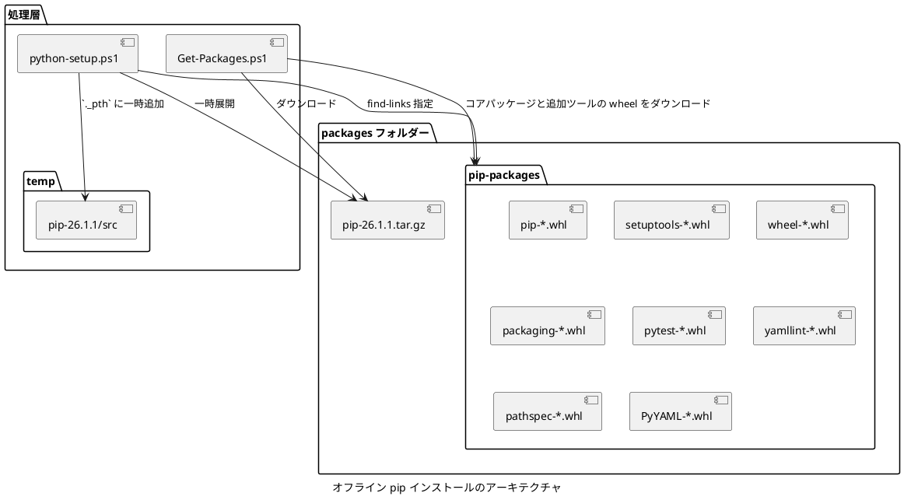
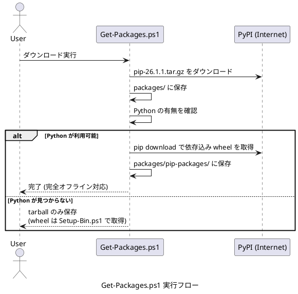
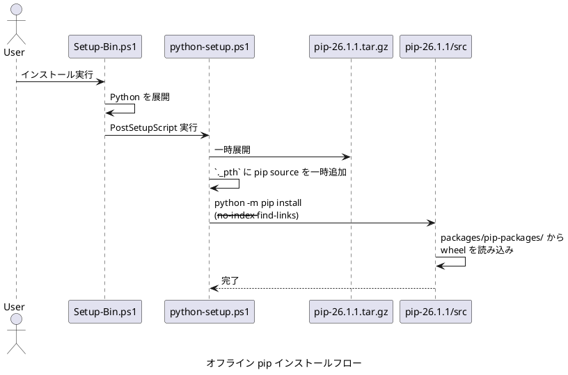
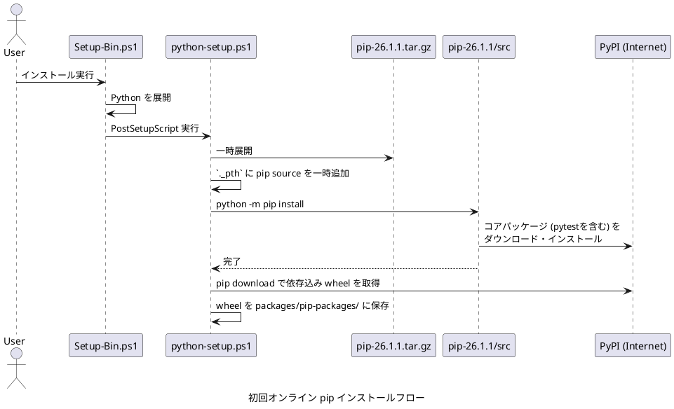

# オフライン pip インストール設計書

## 概要

本文書では、完全オフライン環境での pip インストールを実現するための実装方針を説明します。

pip 本体として PyPI のソース tarball `pip-26.1.1.tar.gz` を取得します。
`python-setup.ps1` はこの tarball を一時展開し、埋め込み Python の `._pth` に `src` を一時追加した状態で `python -m pip` を実行します。
`packages/pip-packages` には Python 初期設定用の `pip`、`setuptools`、`wheel`、`packaging`、`pytest`、追加ツールの `yamllint`、およびそれぞれの依存 wheel を保存し、オフライン インストールに利用します。
pytest は埋め込み Python にプリインストールされるため、システム Python の環境には依存しません。

## 採用理由

この方式により、次の事項を両立できます。

- pip 本体の依存関係解決とインストール処理を pip 自身へ委譲可能
- インストール後も標準的な `python -m pip` をベースとして利用可能

## アーキテクチャ



## 実装仕様

### packages.psd1

`get-pip` パッケージは、次の定義で `pip-26.1.1.tar.gz` を保持します。

```powershell
@{
    Name = "pip source tarball"
    ShortName = "get-pip"
    Version = "26.1.1"
    ArchivePattern = "^pip-26\.1\.1\.tar\.gz$"
    ExtractStrategy = "CopyToPackages"
    DownloadUrl = "https://files.pythonhosted.org/packages/b6/48/cb9b7a682f6fe01a4221e1728941dd4ac3cd9090a17db3779d6ff490b602/pip-26.1.1.tar.gz"
    Hidden = $true
}
```

### Get-Packages.ps1

`Get-Packages.ps1` は次の処理を行います。

1. `pip-26.1.1.tar.gz` を `packages` にダウンロード
2. Python が利用可能であれば、`pip download --only-binary=:all: --python-version <ver> --implementation cp --platform win_amd64 pip setuptools wheel packaging pytest yamllint pyyaml --dest packages/pip-packages` を実行し、依存 wheel も保存。`<ver>` は `packages.psd1` の Python `Version` フィールドから自動的に取得するため、Python バージョンを更新しても自動追従します

### python-setup.ps1

`python-setup.ps1` は次の処理を行います。

1. 埋め込み Python の `._pth` を更新し、`Lib\site-packages` と `import site` を有効化
2. `packages\pip-*.tar.gz` を検出
3. tarball を一時ディレクトリへ展開
4. 展開先の `pip-26.1.1\src` を埋め込み Python の `._pth` に一時追加
5. 共通のコアパッケージ一覧を使って `pip`、`setuptools`、`wheel`、`packaging`、`pytest` をインストール
6. オンライン時は追加で依存込み wheel を `packages/pip-packages` に保存
7. `._pth` と一時展開ディレクトリをクリーンアップ

実行コマンドは次の 2 系統です。

```bash
# オフライン
python -m pip install --no-index --find-links=packages/pip-packages pip setuptools wheel packaging pytest

# オンライン
python -m pip install pip setuptools wheel packaging pytest
```

## 動作フロー

### Get-Packages.ps1 実行フロー



### オフライン環境でのインストールフロー



### 初回オンライン実行フロー



## 運用

### オフラインパッケージの準備

1. インターネット接続のある環境で `Get-Packages.ps1` を実行
2. `packages` フォルダーごとオフライン環境へコピー
3. オフライン環境で `Manage-Bin.cmd` を実行

Python が利用可能な環境では、`Get-Packages.ps1` 実行時点で wheel まで揃うため、そのまま完全オフライン導入に使用できます。

### 手動での wheel 取得

```bash
pip download --only-binary=:all: --python-version <ver> --implementation cp --platform win_amd64 pip setuptools wheel packaging pytest yamllint pyyaml --dest packages/pip-packages
```

`<ver>` には `packages.psd1` の Python バージョン (例: `3.13`) を指定してください。
`Get-Packages.ps1` はこの値を自動取得して渡します。
`--python-version` を省略すると、実行環境の Python バージョン向け wheel が取得され、devbin Python でのオフライン インストールが失敗する場合があります。
既に不適切なバージョンの wheel を取得済みの場合は、`packages/pip-packages/` を削除してから再実行してください。

```text
packages/
+-- pip-packages/
|   +-- pip-26.1.1-py3-none-any.whl
|   +-- setuptools-*.whl
|   +-- wheel-*.whl
|   +-- packaging-*.whl
|   +-- pytest-*.whl
|   +-- iniconfig-*.whl
|   +-- pluggy-*.whl
|   +-- Pygments-*.whl
|   +-- colorama-*.whl
|   +-- yamllint-*.whl
|   +-- pathspec-*.whl
|   \-- PyYAML-*.whl
\-- pip-26.1.1.tar.gz
```

## pip パッケージの追加

pip 経由でインストールする新しいツールを追加する際は、`packages.psd1` に `ExtractStrategy = "PipInstall"` のエントリを追加します。

`PipPackage` に本体パッケージ名、`PipDependencies` にオフライン用に同時に取得・確認する依存パッケージ名を指定します。
`Get-Packages.ps1` はこれらの定義から `pip download` 対象を構築します。

`python-setup.ps1` は、`Get-PipWheelPackageNames -IncludeCorePackages` が返すコア パッケージをプリインストールします。
pytest のようにすべての devbin Python 環境へ導入するパッケージは、この一覧へ追加します。
個別選択するツールは、従来どおり `PipInstall` のエントリとして追加します。

## まとめ

本設計では、`Get-Packages.ps1` がソース tarball と依存関係を含めた wheel を準備し、`python-setup.ps1` は埋め込み Python の `._pth` を一時拡張して、pip と pytest を含むコア パッケージをインストールします。
pip パッケージ型の追加ツール (yamllint 等) は、`Devbin/Extract` の `PipInstall` 戦略が `packages/pip-packages` の wheel からインストールします。
これにより、完全オフライン環境で Python のテスト実行環境を導入できます。
