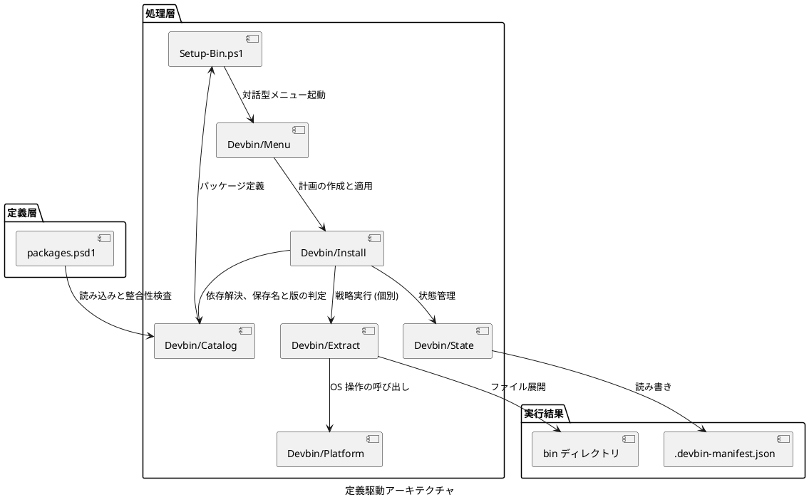
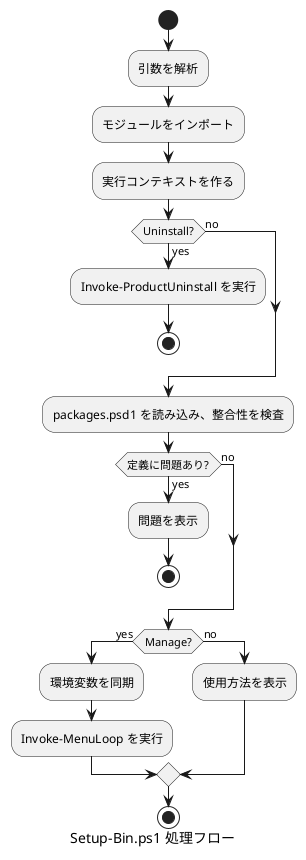

# Setup-Bin.ps1 設計書

## 概要

本文書では、subscripts/Setup-Bin.ps1 の定義駆動アーキテクチャについて説明します。

パッケージの特徴を定義データとして表現し、汎用的な処理エンジンで扱うアプローチを採用しています。
これにより、新規パッケージの追加が定義ファイルへの記述のみで完結し、保守性と拡張性が大幅に向上しています。

## アーキテクチャ概要

### ディレクトリ構造

```text
subscripts/
+- Setup-Bin.ps1          (メインスクリプト)
+- Get-Packages.ps1       (パッケージ取得)
+- Devbin/                (内部モジュール)
|  +- Devbin.psm1         (統合読み込みと公開関数の宣言)
|  +- Context/            (実行コンテキスト: 絶対パスの集約)
|  +- Platform/           (OS 操作: PATH、環境変数、一時領域、アンインストール)
|  +- Extract/            (抽出戦略の実装とディスパッチ)
|  +- Catalog/            (設定読み込み、パッケージ検索、版・保存名、依存関係)
|  +- State/              (マニフェスト入出力、状態判定、ファイル一覧)
|  +- Packages/           (ダウンロードと取得処理)
|  +- Install/            (導入・削除の実行と変更計画)
|  +- Menu/               (CLI 対話型メニュー)
+- config/
   +- packages.psd1       (パッケージ定義)
   +- templates/
      +- python-setup.ps1 (Python 用セットアップスクリプト)
```

### 定義駆動アーキテクチャ



## パッケージ定義ファイル (packages.psd1)

パッケージ定義ファイルの詳細については、[packages-psd1-specification.md](./packages-psd1-specification.md) を参照してください。

### 概要

すべてのパッケージ情報を PowerShell データファイル (.psd1) 形式で一元管理します。
パッケージの定義情報を宣言的に記述することで、コードを変更せずに新しいパッケージを追加できます。

## 抽出戦略 (Extract Strategy)

抽出戦略の詳細については、[extract-strategies-specification.md](./extract-strategies-specification.md) を参照してください。

### 概要

Devbin/Extract に実装された抽出パターンです。
戦略のディスパッチは `Invoke-ExtractStrategy` が担当します。
各戦略は特定の展開方法を表します。

### 戦略一覧

| 戦略名 | 説明 | 対象パッケージ |
|--------|------|---------------|
| Standard | ZIP を展開し、すべてを bin に配置 | Node.js, Pandoc, Doxygen |
| Subdirectory | 特定のサブディレクトリのみ抽出 | nkf, CMake, GNU Make, innoextract, clang-format, gh, copilot, agy, glab |
| SubdirectoryToTarget | サブディレクトリをターゲットディレクトリに抽出 | Graphviz |
| VersionNormalized | バージョン番号を正規化 | JDK, Python |
| TargetDirectory | 指定ディレクトリに展開 | .NET SDK, VS Code, WinFlexBison |
| JarWithWrapper | JAR + cmd ラッパー生成 | PlantUML |
| SingleExecutable | 単一実行ファイルをコピー | NuGet, cloc, vswhere |
| SelfExtractingArchive | 自己解凍実行ファイルを実行 | Portable Git |
| InnoSetup | innoextract で Inno Setup インストーラーを展開 | OpenCppCoverage |
| VSBuildTools | Visual Studio Build Tools のセットアップ | VSBT |

## パッケージ定義の読み込み (Devbin/Catalog)

### 概要

`packages.psd1` の読み込み、パッケージの検索、版と保存アーカイブ名の判定、依存関係の解決を集約しています。

### 主要関数

- `Import-DevbinDataFile`: `.psd1` をハッシュテーブルとして読み込みます。`Import-PowerShellDataFile` は Windows PowerShell 5.1 に存在しないため、同等の仕組みである AST の `SafeGetValue()` を使用します。ファイル内のコードは実行されません。
- `Import-PackageCatalog`: 定義を読み込み、整合性検査の結果 (`Success` / `Packages` / `Errors`) とあわせて返します。
- `Test-PackageCatalog`: 必須プロパティ、`ShortName` の重複、未定義の依存先、循環依存を変更開始前に検出します。
- `Resolve-DependencyOrder`: 導入順を解決します。循環依存と未定義の依存先は順序ではなく失敗として返します。
- `Get-UninstallOrder`: 削除順 (依存元から依存先) を求めます。
- `Get-PackageDownloadFileName`: 保存アーカイブ名を決定します。版表記の判定は区切り文字と大文字小文字の違いを吸収するため、取得側と導入側で同一の名前になります。
- `Get-PipWheelPackageNames` / `Test-PipWheelPackages`: pip パッケージ名の正規化 (PEP 503) と wheel の検証を行います。Python 初期設定用のコアパッケージ (`pip`、`setuptools`、`wheel`、`packaging`、`pytest`) は `-IncludeCorePackages` で指定し、取得・検証・インストールで同一の一覧を使用します。
- `Get-PythonDirectory`: Python の配置先をパッケージ定義の `TargetDirectory` から取得します。

## 実行コンテキスト (Devbin/Context)

`New-DevbinContext` がリポジトリ、設定、packages、導入先、一時領域の絶対パスを集約して返します。
各処理はこのコンテキストを受け取るため、カレントディレクトリに依存しません。

## OS 操作モジュール (Devbin/Platform)

### 概要

PATH、環境変数、ファイル、一時領域、アンインストールなど、OS を操作する処理を集約しています。
従来の `Setup-Common.psm1` を責務ごとのファイルに分割し、`Devbin.psm1` から読み込みます。

| ファイル | 担当 |
|----------|------|
| CommandLookup.ps1 | 外部コマンドの存在確認 |
| TempDirectory.ps1 | 実行単位で独立した一時領域の作成と削除 |
| FileSystem.ps1 | 長いパス対応のファイル操作、ディレクトリツリー削除 |
| EnvironmentVariable.ps1 | 環境変数の同期 |
| UserPath.ps1 | ユーザー PATH の追加、削除、再構成 |
| VSCodeData.ps1 | VS Code data フォルダーの退避と復元 |
| Vswhere.ps1 | vswhere インスタンスの登録と削除 |
| ProductRoot.ps1 | 対象ルートの決定と、削除対象として妥当な配置場所かの判定 |
| OperationLog.ps1 | 操作ログの配置と Transcript の開始・終了 |
| FontRegistration.ps1 | フォント登録の削除 |
| WindowsTerminal.ps1 | settings.json の読み書きとバックアップ |
| WindowsTerminalProfile.ps1 | Git Bash / MinGW プロファイルの更新 |
| ProductUninstall.ps1 | 事前クリーンアップと完全アンインストール |
| HomeDirectory.ps1 | HOME と XDG ディレクトリの計画と適用 |
| BusySignal.ps1 | 実行中表示 |

### 主要関数

#### パス管理

- `Add-ToUserPath`: ユーザー PATH にディレクトリを追加 (一括)
- `Remove-FromUserPath`: ユーザー PATH からディレクトリを削除 (一括)
- `Sync-ManagedUserPath`: packages.psd1 の宣言順と `PathPosition` に基づいて devbin-win 管理 PATH を再構成
- `Add-SinglePathDir`: 単一ディレクトリを PATH に追加
- `Remove-SinglePathDir`: 単一ディレクトリを PATH から削除

#### 環境変数管理

- `Sync-EnvironmentVariable`: レジストリから環境変数を同期
- `Sync-EnvironmentVariables`: 複数の環境変数を一括同期

#### ファイル操作

- `Convert-ToLongPath`: 長いパスを UNC 形式に変換
- `New-LongPathDirectory`: 長いパス対応のディレクトリ作成
- `Copy-LongPathFile`: 長いパス対応のファイルコピー

#### VS Code データ管理

- `Backup-VSCodeData`: VS Code data フォルダーのバックアップ
- `Restore-VSCodeData`: VS Code data フォルダーの復元

#### 一時領域と HOME

- `New-DevbinTempDirectory` / `Remove-DevbinTempDirectory`: 実行ごとに独立した一時ディレクトリを作成し、一時領域外のファイルは削除しません。
- `Get-DevbinHomeLayout`: HOME 配下に作成する項目と環境変数名の対応関係を返します。
- `Get-DevbinHomePlan` / `Invoke-DevbinHomePlan`: 変更内容を計画として生成した上で適用します。

#### アンインストール

- `Invoke-CompleteUninstall`: 再インストール用の事前クリーンアップ (bin ディレクトリ削除。VS Code data を維持する指定も可能) を行います。
- `Get-DevbinProductRoot`: InstallDir から対象ルート (`...\devbin-win`) を決定します。
- `Get-DevbinOperationLogDirectory`: 操作ログの配置先 (製品ルートの親ディレクトリ) を返します。
- `New-DevbinOperationLogPath`: `devbin-win-operation-yyyyMMdd-HHmmss.log` のパスを生成します。既存ファイルは上書きしません。
- `Start-DevbinOperationLog` / `Stop-DevbinOperationLog`: 操作結果を Transcript で記録します。完全アンインストール時でも削除されないよう製品ルートの外部へ出力し、ログ自体は保持します。
- `Test-DevbinProductRootAllowed`: 対象ルートが `%ProgramData%\%USERNAME%\devbin-win` と一致するかを判定します。一致しない場合は削除を実行しません。
- `Test-PathUnderRoot`: 指定されたパスが対象ルート配下であるかを判定します。
- `Split-RootEntriesFromValue`: `;` 区切りの値を対象ルート配下のエントリとそれ以外に分割します。
- `Remove-DirectoryTree`: ディレクトリツリーを削除します。260 文字を超えるパスで失敗した場合は robocopy の `/MIR` オプションでディレクトリ内を空にしてから削除します。
- `ConvertFrom-JsonWithComments`: コメント付き JSON (Windows Terminal の settings.json) を読み込みます。
- `Invoke-ProductUninstall`: 状態に依存しない完全アンインストールを実行します。対象ルートと、当該ルートを参照する PATH、環境変数、フォント登録、Windows Terminal プロファイル、vswhere を機械的に削除します。

## 状態管理 (Devbin/State)

### 概要

コンポーネント単位のインストール状態を `$InstallDir\.devbin-manifest.json` に記録します。
コンポーネントマネージャーが個別管理を行うための基盤となります。

`Manifest.ps1` がマニフェストの入出力とファイル一覧を、`ComponentStatus.ps1` が版の比較と状態判定を担当します。

### マニフェストの構造

```json
{
  "version": 1,
  "components": {
    "nodejs": {
      "installedAt": "2026-04-09T10:00:00Z",
      "archiveFile": "node-v25.9.0-win-x64.zip",
      "files": ["node.exe", "npm.cmd"],
      "pathDirs": [],
      "envVars": {}
    }
  }
}
```

### 主要関数

- `Read-Manifest`: マニフェストを読み込みます (存在しない場合は空データを返します)。
- `Write-Manifest`: 一時ファイルを経由してマニフェストを置換します。失敗時は旧ファイルを保持し、失敗結果を返します。
- `Add-ComponentToManifest`: コンポーネント記録を追加します。
- `Remove-ComponentFromManifest`: コンポーネント記録を削除します。
- `Test-ComponentInstalled`: マニフェスト上のインストール状態を確認します。
- `Test-ComponentFiles`: ファイルシステム上の実在を確認します。
- `Get-ComponentStatus`: 総合ステータスを返します (Installed / Updateable / NotInstalled / Broken / Legacy)。
- `Get-DirectorySnapshot`: ディレクトリ内のファイル一覧のスナップショットを取得します。
- `Get-FileSnapshotDiff`: インストール前後のスナップショット差分を取得します。
- `Initialize-LegacyManifest`: マニフェストが存在しないレガシーインストール状態をスキャンして生成します。

`Updateable` は、`packages.psd1` の `Version` がマニフェストに記録されたインストール済みバージョンより新しい場合に返されます。
メニューでは初期表示時に `[R]` 指定となり、更新インストールを促します。

## 導入と削除 (Devbin/Install)

### 概要

コンポーネント単位の導入・再導入・削除と、その操作計画を集約しています。
従来の `Setup-Components.psm1` を責務ごとのファイルに分割しました。
依存関係の解決は Devbin/Catalog が行います。
UI は計画の表示と確認のみを行い、依存解決やマニフェストへの書き込みは行いません。

| ファイル | 担当 |
|----------|------|
| ComponentEnvironment.ps1 | 環境変数の値の決定と設定・削除 |
| ComponentPath.ps1 | コンポーネントのディレクトリを PATH へ反映 |
| LifecycleScript.ps1 | PostInstallScripts / PostUninstallScripts の実行 |
| ComponentSource.ps1 | アーカイブ、npm キャッシュ、pip wheel の用意 |
| ComponentInstall.ps1 | 導入と再導入 |
| ComponentFileRemoval.ps1 | 削除対象ファイルの判定と削除 |
| ComponentUninstall.ps1 | 削除と、孤立した依存関係の解消 |
| ComponentChangePlan.ps1 | 操作計画の作成と適用 |

### 主要関数

- `Install-Component`: コンポーネントを取得・展開し、環境変数と PATH を設定してマニフェストに登録します。
- `Uninstall-Component`: 依存元を確認してコンポーネントを削除し、孤立した非公開の依存関係 (Hidden) も解消します。
- `Update-Component`: コンポーネントを再インストール (更新) します。
- `Resolve-ComponentSource`: 導入に必要なファイルを確認し、不足していれば取得を試みます。ファイルが揃わない場合は失敗を返します。
- `Get-ComponentEnvVarValues`: `EnvVars` と `EnvVarIsLiteral` から実際に設定する値を算出します。設定側と削除側で同一の値を参照するよう、計算ロジックを一元化しています。
- `Remove-ComponentInstalledFiles`: マニフェストのファイル一覧または `DetectFiles` に基づいて実体を削除します。他のコンポーネントが参照しているファイルとディレクトリは保持します。

- `New-ComponentChangePlan`: 定義、現在の状態、選択内容から操作順序の計画を生成します。導入は依存先から、削除は依存元から並べ、残存するパッケージが必要とする依存先は削除対象から除外します。依存関係の欠落や循環は計画生成の段階で失敗として返します。
- `Invoke-ComponentChangePlan`: 確認画面に表示した計画をそのまま実行します。操作ごとにマニフェストを保存し、保存に失敗した時点で処理を中断します。依存先の導入に失敗した場合、そのコンポーネントに依存する後続処理はスキップします。

操作結果は `Status`、`ShortName`、`Message`、`Warnings` プロパティを持つオブジェクトとして返します。
`Status` は `Installed`、`Reinstalled`、`Uninstalled`、`Failed`、`Skipped`、`Aborted` のいずれかです。
バッチ全体の自動ロールバックは行わず、完了済みの操作と失敗箇所を明確に提示します。

新規導入と再インストールは、依存関係に従い依存先から順次実行します。
再インストール時も不足している Hidden 依存を計画に含め、Broken な状態の依存先は再インストールによって修復します。
依存先の失敗に伴うスキップ処理は、新規導入と再インストールの双方に適用します。
削除可否の判定にはマニフェストの情報だけでなく、選択中の新規導入予定や Legacy な依存元の存在も考慮します。

## CLI 対話型メニュー (Devbin/Menu)

### 概要

外部ライブラリを使用せず、コンソール出力と Windows のコンソール入力 API のみで実装したテキストメニューです。
従来の `Setup-Menu.psm1` を責務ごとのファイルに分割しました。

| ファイル | 担当 |
|----------|------|
| ConsoleInput.ps1 | キーとホイールの読み取り (ネイティブ定義を含む) |
| MenuState.ps1 | 表示する一覧と選択状態、コンポーネントの状態の取得 |
| MenuNavigation.ps1 | カーソル移動、表示範囲の追従、選択の切り替え |
| MenuRender.ps1 | 画面の描画 |
| MenuActions.ps1 | 選択内容の適用と、計画・結果の表示 |
| MenuLoop.ps1 | キー操作の振り分けと主ループ |

### 主要関数

- `Get-MenuItems`: 表示対象のコンポーネント一覧を生成します (Hidden 指定のコンポーネントは除外)。
- `Invoke-MenuLoop`: 入力待ちループを実行します (`Q` キーで終了)。
- `Invoke-MenuProductUninstall`: `U` キー入力時に `Invoke-ProductUninstall` を呼び出し、製品の完全アンインストールを実行します。
- `Initialize-ConsoleInputType`: コンソール入力用のネイティブ型定義を初期化します。メニュー起動時にのみ実行することで、モジュール読み込み時のオーバーヘッドを抑えています。

## メインスクリプト (Setup-Bin.ps1)

### 概要

引数を解析し、コンポーネントマネージャーの起動または製品の完全アンインストールへ処理を分岐します。
一括導入専用のモード (`-Extract` / `-Install`) は廃止し、全コンポーネントの導入操作はコンポーネントマネージャーの全選択機能へ統合しました。

### 処理フロー



### 主要機能

#### コンポーネントマネージャーの起動

`-Manage` パラメーター指定時は、環境変数をレジストリから同期した上で `Invoke-MenuLoop` を呼び出します。
導入・再導入・削除の実際の処理は `New-ComponentChangePlan` および `Invoke-ComponentChangePlan` が担当します。

#### 完全アンインストール

`-Uninstall` パラメーターは、`Invoke-ProductUninstall` を呼び出すエントリーポイントです。
対象ルートが `%ProgramData%\%USERNAME%\devbin-win` と一致しない場合は、安全のため削除を実行せず処理を拒否します。
終了コードは、成功時は 0、ユーザーによるキャンセルの場合は 2、実行拒否およびエラー終了時は 1 となります。

## ダウンロードスクリプト (Get-Packages.ps1)

### 概要

packages.psd1 からダウンロード URL を読み込み、必要なパッケージアーカイブをダウンロードします。

### 処理フロー

1. `packages.psd1` を読み込みます。
2. 各パッケージの `DownloadUrl`、`DownloadHeaders`、保存ファイル名を抽出し、必要に応じてバージョン情報付きの保存名へ正規化します。
3. `DownloadHeaders` が指定されている場合は HTTP ヘッダーとして付与し、ファイルをダウンロードします。
4. 対象パッケージの `ArchivePattern` に一致する旧バージョンのファイル、および不要となった元のファイル名の一時ファイルを削除します。
5. ダウンロードした `.exe` ファイルのゾーン識別子 (ブロック) を解除します。
6. `NpmInstall` 定義のパッケージについては `Devbin/Packages/Npm/DevbinNpm.psm1` を呼び出し、ShortName ごとに依存ツリー、`package-lock.json`、`npm-cache-manifest.json` を `packages/npm-packages/<ShortName>/` 配下に保存します。

`NpmInstall` による導入時は、マニフェスト、lockfile、および全アーカイブの SHA-512 ハッシュ値を検証した上で、一時 npm キャッシュへアーカイブを登録します。
lockfile の `resolved` と `integrity` をローカルアーカイブへ差し替えた一時プロジェクトに対して `npm install --offline` を実行し、生成された `node_modules` およびコマンド shim をインストール先ディレクトリへマージします。
キャッシュの不足が検出された場合のみ `Get-Packages.ps1 -PackageShortNames` の自動実行を試行し、取得後も不完全な状態である場合は導入処理を開始しません。

### SourceForge URL 対応

SourceForge の URL は、自動的に実際のダウンロード URL へ変換されます。

### ダウンロードヘッダー対応

`DownloadHeaders` が定義されているパッケージでは、`Get-Packages.ps1` が `Invoke-WebRequest` に該当ヘッダーを渡してダウンロードを実行します。
配布元サーバーが直接ダウンロードに対して `User-Agent` や `Referer` の指定を要求する場合に使用します。

### 過去バージョンファイルのクリーンアップ

`Get-Packages.ps1` は、ダウンロード対象となったパッケージについて、`packages` 直下の同一 `ArchivePattern` に一致する古いバージョンファイルを削除します。
古いファイルを削除する際は、現在の保存ファイル名、削除対象件数、および対象ファイル名を表示します。
バージョン付き保存名と URL 由来の元ファイル名が異なる場合は、ダウンロード成功後に元ファイル名側も削除します。
現在の保存ファイル名と一致するファイルは保持し、ダウンロードに失敗した場合は旧ファイルおよび元ファイルも削除せず保持します。
なお、`packages/vsbt` や `packages/pip-packages` などのサブディレクトリはクリーンアップの対象外です。

`Version` が定義されているパッケージは、`DownloadFileName` が未指定であっても `packages` フォルダー上ではバージョン付きファイル名へ正規化して保存します (バージョン比較では `.`、`_`、`-` の区切り記号の差異を同一と見なします)。
`ArchivePattern` は、この正規化後の保存名と一致するよう定義することを前提としています。
`Install-Component` は後方互換性のため、`ArchivePattern` に一致するファイルが存在しない場合に限り、`packages` 直下の URL 由来ファイル名へフォールバックして探索します。

## 新規パッケージの追加手順

新規パッケージの追加手順の詳細については、[packages-psd1-specification.md](./packages-psd1-specification.md) および [extract-strategies-specification.md](./extract-strategies-specification.md) を参照してください。

### ケース1: 既存の戦略で対応できる場合

`packages.psd1` に定義を追加するだけで完了します。スクリプトコードの変更は不要です。

### ケース2: 新しい戦略が必要な場合

1. `Devbin/Extract` に新しい戦略関数を追加します。
2. `Invoke-ExtractStrategy` の switch 文に該当戦略の分岐を追加します。
3. `packages.psd1` にパッケージ定義を追加します。

## メリット

### 保守性の向上

- パッケージ情報の一元管理
- 新規パッケージ追加の容易性
- 変更時の影響範囲の局所化

### コード量の削減

- 旧実装 (1735 行) からの大幅なコード量削減
- 重複コードの排除
- `elseif` 連鎖の解消

### 拡張性の向上

- 新しい抽出戦略の追加による複数パッケージへの横断的適用
- 展開パターンの標準化
- 処理ロジックの再利用

### テスト容易性

- 各抽出戦略の独立したテストが可能
- モックデータを用いた単体テストの実現

## まとめ

定義駆動アーキテクチャの採用により、次の利点を実現しています。

- パッケージ情報の一元管理 (`packages.psd1`)
- 展開処理の標準化と再利用 (`Devbin/Extract`)
- 新規パッケージ追加の容易化 (定義ファイルへの記述のみで対応可能)
- パッケージダウンロードとセットアップの連携 (`DownloadUrl` の統合管理)
- スクリプトコード全体の保守性と拡張性の向上

新規パッケージの追加は、既存の抽出戦略で対応可能な場合、`packages.psd1` への記述のみで完結します。
