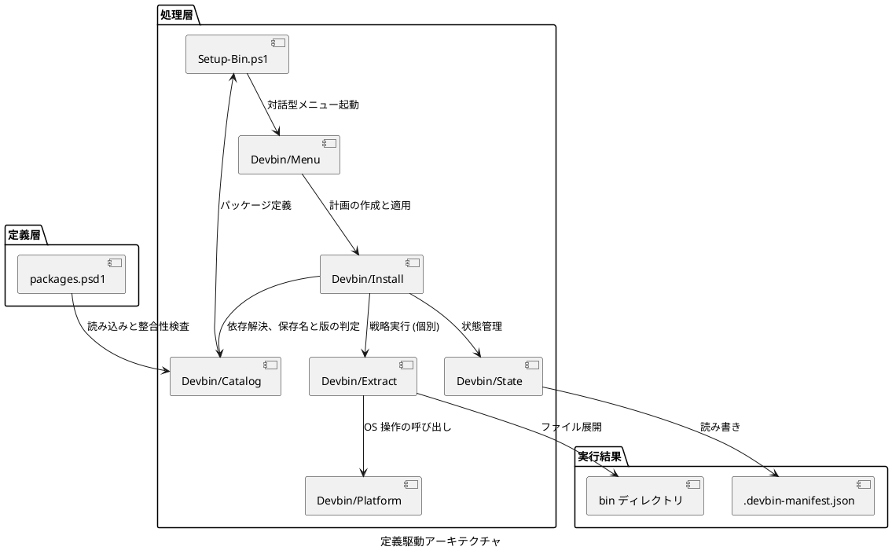
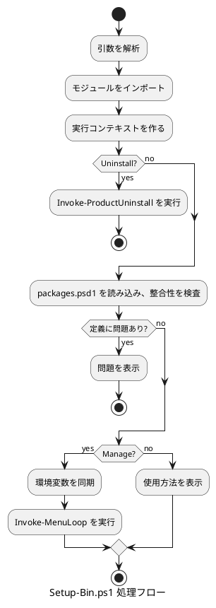

# Setup-Bin.ps1 設計書

## 概要

本文書では、subscripts/Setup-Bin.ps1 の定義駆動アーキテクチャについて説明します。

パッケージの特徴を定義データとして表現し、汎用的な処理エンジンで扱うアプローチを採用しています。これにより、新規パッケージの追加が定義ファイルへの記述のみで完結し、保守性と拡張性が大幅に向上しています。

## アーキテクチャ概要

### ディレクトリ構造

```text
subscripts/
+- Setup-Bin.ps1          (メインスクリプト)
+- Get-Packages.ps1       (パッケージ取得)
+- Devbin/                (内部モジュール)
|  +- Devbin.psm1         (読み込み窓口と公開関数の宣言)
|  +- Context/            (実行コンテキスト: 絶対パスの集約)
|  +- Platform/           (OS 操作: PATH、環境変数、一時領域、アンインストール)
|  +- Extract/            (抽出戦略の実装と呼び分け)
|  +- Catalog/            (設定読み込み、パッケージ検索、版・保存名、依存関係)
|  +- State/              (マニフェスト入出力、状態判定、ファイル一覧)
|  +- Packages/           (ダウンロードと取得処理)
|  +- Install/            (導入・削除の実行と変更計画)
|  +- Menu/               (CLI 対話型メニュー)
+- config/
   +- packages.psd1       (パッケージ定義)
   +- templates/
      +- python-setup.ps1 (Python 用セットアップスクリプト)
```

### 定義駆動アーキテクチャ



## パッケージ定義ファイル (packages.psd1)

パッケージ定義ファイルの詳細については、[packages-psd1-specification.md](./packages-psd1-specification.md) を参照してください。

### 概要

すべてのパッケージ情報を PowerShell データファイル (.psd1) 形式で一元管理します。パッケージの定義情報を宣言的に記述することで、コードを変更せずに新しいパッケージを追加できます。

## 抽出戦略 (Extract Strategy)

抽出戦略の詳細については、[extract-strategies-specification.md](./extract-strategies-specification.md) を参照してください。

### 概要

Devbin/Extract に実装された抽出パターンです。呼び分けは `Invoke-ExtractStrategy` が行います。各戦略は特定の展開方法を表します。

### 戦略一覧

| 戦略名 | 説明 | 対象パッケージ |
|--------|------|---------------|
| Standard | ZIP を展開し、すべてを bin に配置 | Node.js, Pandoc, Doxygen |
| Subdirectory | 特定のサブディレクトリのみ抽出 | nkf, CMake, GNU Make, innoextract, clang-format, gh, copilot, glab |
| SubdirectoryToTarget | サブディレクトリをターゲットディレクトリに抽出 | Graphviz |
| VersionNormalized | バージョン番号を正規化 | JDK, Python |
| TargetDirectory | 指定ディレクトリに展開 | .NET SDK, VS Code, WinFlexBison |
| JarWithWrapper | JAR + cmd ラッパー生成 | PlantUML |
| SingleExecutable | 単一実行ファイルをコピー | NuGet, cloc, vswhere |
| SelfExtractingArchive | 自己解凍実行ファイルを実行 | Portable Git |
| InnoSetup | innoextract で Inno Setup インストーラーを展開 | OpenCppCoverage |
| VSBuildTools | Visual Studio Build Tools のセットアップ | VSBT |

## パッケージ定義の読み込み (Devbin/Catalog)

### 概要

`packages.psd1` の読み込み、パッケージの検索、版と保存アーカイブ名の判定、依存関係の解決をまとめています。

### 主要関数

- `Import-DevbinDataFile`: `.psd1` をハッシュテーブルとして読み込む。`Import-PowerShellDataFile` は Windows PowerShell 5.1 に存在しないため、同等の仕組みである AST の `SafeGetValue()` を使用する。ファイル内のコードは実行されない
- `Import-PackageCatalog`: 定義を読み込み、整合性検査の結果 (`Success` / `Packages` / `Errors`) とあわせて返す
- `Test-PackageCatalog`: 必須プロパティ、`ShortName` の重複、未定義の依存先、循環依存を変更開始前に検出する
- `Resolve-DependencyOrder`: 導入順を解決する。循環依存と未定義の依存先は順序ではなく失敗として返す
- `Get-UninstallOrder`: 削除順 (依存元から依存先) を求める
- `Get-PackageDownloadFileName`: 保存アーカイブ名を決定する。版表記の判定は区切り文字と大文字小文字の違いを吸収するため、取得側と導入側で同じ名前になる
- `Get-PipWheelPackageNames` / `Test-PipWheelPackages`: pip パッケージ名の正規化 (PEP 503) と wheel の検証。Python 初期設定用のコアパッケージ (`pip`、`setuptools`、`wheel`、`packaging`、`pytest`) は `-IncludeCorePackages` で表し、取得・検証・インストールで同じ一覧を使用する
- `Get-PythonDirectory`: Python の配置先をパッケージ定義の `TargetDirectory` から取得する

## 実行コンテキスト (Devbin/Context)

`New-DevbinContext` がリポジトリ、設定、packages、導入先、一時領域の絶対パスをまとめて返します。各処理はこのコンテキストを受け取るため、カレントディレクトリに依存しません。

## OS 操作モジュール (Devbin/Platform)

### 概要

PATH、環境変数、ファイル、一時領域、アンインストールなど、OS を操作する処理をまとめています。以前の `Setup-Common.psm1` を責務ごとのファイルに分け、`Devbin.psm1` から読み込みます。

| ファイル | 担当 |
|----------|------|
| CommandLookup.ps1 | 外部コマンドの存在確認 |
| TempDirectory.ps1 | 実行ごとに分かれた一時領域の作成と削除 |
| FileSystem.ps1 | 長いパス対応のファイル操作、ディレクトリツリー削除 |
| EnvironmentVariable.ps1 | 環境変数の同期 |
| UserPath.ps1 | ユーザー PATH の追加、削除、再構成 |
| VSCodeData.ps1 | VS Code data フォルダーの退避と復元 |
| Vswhere.ps1 | vswhere インスタンスの登録と削除 |
| ProductRoot.ps1 | 対象ルートの決定と、削除してよい場所かの判定 |
| OperationLog.ps1 | 操作ログの配置と Transcript の開始・終了 |
| FontRegistration.ps1 | フォント登録の削除 |
| WindowsTerminal.ps1 | settings.json の読み書きとバックアップ |
| WindowsTerminalProfile.ps1 | Git Bash / MinGW プロファイルの更新 |
| ProductUninstall.ps1 | 事前クリーンアップと完全アンインストール |
| HomeDirectory.ps1 | HOME と XDG ディレクトリの計画と適用 |
| BusySignal.ps1 | 実行中表示 |

### 主要関数

#### パス管理

- `Add-ToUserPath`: ユーザー PATH にディレクトリを追加 (一括)
- `Remove-FromUserPath`: ユーザー PATH からディレクトリを削除 (一括)
- `Sync-ManagedUserPath`: packages.psd1 の宣言順と `PathPosition` に基づいて devbin-win 管理 PATH を再構成
- `Add-SinglePathDir`: 単一ディレクトリを PATH に追加
- `Remove-SinglePathDir`: 単一ディレクトリを PATH から削除

#### 環境変数管理

- `Sync-EnvironmentVariable`: レジストリから環境変数を同期
- `Sync-EnvironmentVariables`: 複数の環境変数を一括同期

#### ファイル操作

- `Convert-ToLongPath`: 長いパスを UNC 形式に変換
- `New-LongPathDirectory`: 長いパス対応のディレクトリ作成
- `Copy-LongPathFile`: 長いパス対応のファイルコピー

#### VS Code データ管理

- `Backup-VSCodeData`: VS Code data フォルダーのバックアップ
- `Restore-VSCodeData`: VS Code data フォルダーの復元

#### 一時領域と HOME

- `New-DevbinTempDirectory` / `Remove-DevbinTempDirectory`: 実行ごとに別の一時ディレクトリを作り、一時領域の外は消さない
- `Get-DevbinHomeLayout`: HOME 配下に作る項目と環境変数名の対応を返す
- `Get-DevbinHomePlan` / `Invoke-DevbinHomePlan`: 変更内容を計画として作ってから適用する

#### アンインストール

- `Invoke-CompleteUninstall`: 再インストール用の事前クリーンアップ (bin ディレクトリ削除。VS Code data を残す指定可)
- `Get-DevbinProductRoot`: InstallDir から対象ルート (`...\devbin-win`) を決定する
- `Get-DevbinOperationLogDirectory`: 操作ログの配置先 (製品ルートの親) を返す
- `New-DevbinOperationLogPath`: `devbin-win-operation-yyyyMMdd-HHmmss.log` のパスを組み立てる。既存ファイルは上書きしない
- `Start-DevbinOperationLog` / `Stop-DevbinOperationLog`: 操作結果を Transcript で残す。完全アンインストールでも消えないよう製品ルートの外へ書き、ログ自体は削除しない
- `Test-DevbinProductRootAllowed`: 対象ルートが `%ProgramData%\%USERNAME%\devbin-win` かどうかを判定する。一致しない場合は削除を行わない
- `Test-PathUnderRoot`: 値が対象ルート配下のパスかを判定する
- `Split-RootEntriesFromValue`: `;` 区切りの値を対象ルート配下のエントリとそれ以外に分ける
- `Remove-DirectoryTree`: ディレクトリツリーを削除する。260 文字を超えるパスで失敗した場合は robocopy の `/MIR` で中身を空にしてから削除する
- `ConvertFrom-JsonWithComments`: コメント付き JSON (Windows Terminal の settings.json) を読み込む
- `Invoke-ProductUninstall`: 状態に依存しない完全アンインストール。対象ルートと、そこを指す PATH / 環境変数 / フォント登録 / Windows Terminal プロファイル / vswhere を機械的に削除する

## 状態管理 (Devbin/State)

### 概要

コンポーネント単位のインストール状態を `$InstallDir\.devbin-manifest.json` に記録します。コンポーネントマネージャーが個別管理を行うための基盤となります。

`Manifest.ps1` がマニフェストの入出力とファイル一覧を、`ComponentStatus.ps1` が版の比較と状態判定を担当します。

### マニフェストの構造

```json
{
  "version": 1,
  "components": {
    "nodejs": {
      "installedAt": "2026-04-09T10:00:00Z",
      "archiveFile": "node-v25.9.0-win-x64.zip",
      "files": ["node.exe", "npm.cmd"],
      "pathDirs": [],
      "envVars": {}
    }
  }
}
```

### 主要関数

- `Read-Manifest`: マニフェストを読み込む (存在しなければ空を返す)
- `Write-Manifest`: 一時ファイルからマニフェストを置換する。失敗時は旧ファイルを保持し、失敗を返す
- `Add-ComponentToManifest`: コンポーネント記録を追加
- `Remove-ComponentFromManifest`: コンポーネント記録を削除
- `Test-ComponentInstalled`: マニフェスト上のインストール状態を確認
- `Test-ComponentFiles`: ファイルシステム上の実在確認
- `Get-ComponentStatus`: 総合ステータスを返す (Installed / Updateable / NotInstalled / Broken / Legacy)
- `Get-DirectorySnapshot`: ディレクトリのファイル一覧をスナップショット
- `Get-FileSnapshotDiff`: インストール前後のスナップショット差分を取得
- `Initialize-LegacyManifest`: レガシーインストール (マニフェストなし) をスキャンして生成

`Updateable` は、`packages.psd1` の `Version` がマニフェストに記録されたインストール済みバージョンより新しい場合に返されます。メニューでは初期表示時に `[R]` 指定となり、更新インストールを促します。

## 導入と削除 (Devbin/Install)

### 概要

コンポーネント単位の導入・再導入・削除と、その操作計画をまとめています。以前の `Setup-Components.psm1` を責務ごとのファイルに分けました。依存関係の解決は Devbin/Catalog が行います。UI は計画の表示と確認だけを行い、依存解決もマニフェストの書き込みも行いません。

| ファイル | 担当 |
|----------|------|
| ComponentEnvironment.ps1 | 環境変数の値の決定と設定・削除 |
| ComponentPath.ps1 | コンポーネントのディレクトリを PATH へ反映 |
| LifecycleScript.ps1 | PostInstallScripts / PostUninstallScripts の実行 |
| ComponentSource.ps1 | アーカイブ、npm キャッシュ、pip wheel の用意 |
| ComponentInstall.ps1 | 導入と再導入 |
| ComponentFileRemoval.ps1 | 削除対象ファイルの判定と削除 |
| ComponentUninstall.ps1 | 削除と、孤立した依存の後始末 |
| ComponentChangePlan.ps1 | 操作計画の作成と適用 |

### 主要関数

- `Install-Component`: コンポーネントを取得・展開し、環境変数と PATH を設定してマニフェストに登録する
- `Uninstall-Component`: 依存元を確認してコンポーネントを削除し、孤立した隠し依存も片付ける
- `Update-Component`: コンポーネントを再インストール (更新)
- `Resolve-ComponentSource`: 導入に必要なファイルを確認し、不足していれば取得を試みる。揃わなければ失敗を返す
- `Get-ComponentEnvVarValues`: `EnvVars` と `EnvVarIsLiteral` から実際に設定する値を求める。設定側と削除側が同じ値を見るよう、計算はここだけにある
- `Remove-ComponentInstalledFiles`: マニフェストのファイル一覧または `DetectFiles` に基づいて実体を削除する。他コンポーネントが参照しているファイルとディレクトリは残す

- `New-ComponentChangePlan`: 定義・現在状態・選択から操作順を作る。導入は依存先から、削除は依存元から並べ、残るパッケージが必要とする依存先は削除対象にしない。依存の欠落・循環はここで失敗として返す
- `Invoke-ComponentChangePlan`: 確認画面に表示した計画をそのまま実行する。操作ごとにマニフェストを保存し、保存に失敗した時点で適用を止める。依存先が失敗した場合、それを必要とするコンポーネントはスキップする

操作結果は `Status` / `ShortName` / `Message` / `Warnings` を持つオブジェクトで返します。`Status` は `Installed` / `Reinstalled` / `Uninstalled` / `Failed` / `Skipped` / `Aborted` のいずれかです。バッチ全体の自動ロールバックは行わず、完了済みの操作と失敗箇所を示します。

新規導入と再インストールは合わせて依存先から実行します。再インストール時も不足した Hidden 依存を計画に含め、Broken な依存先は再インストールで修復します。依存先の失敗によるスキップは新規導入・再インストールの両方に適用します。削除の可否はマニフェストだけでなく、選択されている新規導入予定と Legacy の依存元も含めて判定します。

## CLI 対話型メニュー (Devbin/Menu)

### 概要

外部ライブラリを使わず、コンソール出力と Windows のコンソール入力 API だけで実装したテキストメニューです。以前の `Setup-Menu.psm1` を責務ごとのファイルに分けました。

| ファイル | 担当 |
|----------|------|
| ConsoleInput.ps1 | キーとホイールの読み取り (ネイティブ定義を含む) |
| MenuState.ps1 | 表示する一覧と選択状態、コンポーネントの状態の取得 |
| MenuNavigation.ps1 | カーソル移動、表示範囲の追従、選択の切り替え |
| MenuRender.ps1 | 画面の描画 |
| MenuActions.ps1 | 選択内容の適用と、計画・結果の表示 |
| MenuLoop.ps1 | キー操作の振り分けと主ループ |

### 主要関数

- `Get-MenuItems`: 表示するコンポーネントの一覧を作る (Hidden は除く)
- `Invoke-MenuLoop`: 入力ループ (`Q` で終了)
- `Invoke-MenuProductUninstall`: `U` で `Invoke-ProductUninstall` を実行する完全アンインストール
- `Initialize-ConsoleInputType`: コンソール入力のネイティブ定義を用意する。メニューを開いたときだけ実行し、モジュールの読み込みを遅くしない

## メインスクリプト (Setup-Bin.ps1)

### 概要

引数を処理し、コンポーネントマネージャーの起動か製品の完全アンインストールへ振り分けます。一括導入専用のモード (`-Extract` / `-Install`) は廃止し、すべてを導入する操作はコンポーネントマネージャーの全選択に集約しました。

### 処理フロー



### 主要機能

#### コンポーネントマネージャーの起動

`-Manage` では、環境変数をレジストリから同期したうえで `Invoke-MenuLoop` を呼びます。導入・再導入・削除の実処理は `New-ComponentChangePlan` と `Invoke-ComponentChangePlan` が担当します。

#### 完全アンインストール

`-Uninstall` は `Invoke-ProductUninstall` への薄い入口です。対象ルートが `%ProgramData%\%USERNAME%\devbin-win` でない場合は、何も削除せず拒否します。終了コードは成功が 0、キャンセルが 2、拒否と失敗が 1 です。

## ダウンロードスクリプト (Get-Packages.ps1)

### 概要

packages.psd1 からダウンロード URL を読み込み、パッケージをダウンロードします。

### 処理フロー

1. packages.psd1 を読み込む
2. 各パッケージの DownloadUrl、DownloadHeaders、保存ファイル名を抽出し、必要に応じて Version 付きの保存名へ正規化
3. DownloadHeaders が指定されていれば HTTP ヘッダーとして付与してファイルをダウンロード
4. 対象パッケージの ArchivePattern に一致する過去バージョンのファイルと、不要になった元ファイル名を削除
5. .exe ファイルをブロック解除
6. `NpmInstall` 定義については `Devbin/Packages/Npm/DevbinNpm.psm1` を呼び出し、ShortName ごとに依存木、`package-lock.json`、`npm-cache-manifest.json` を `packages/npm-packages/<ShortName>/` へ保存

`NpmInstall` の導入時は manifest、lock、全 archive の SHA-512 を検証したうえで、一時 npm cache に archive を登録します。lockfile の `resolved` と `integrity` をローカル archive に差し替えた一時プロジェクトへ `npm install --offline` し、生成された `node_modules` と command shim をインストール先へマージします。キャッシュ不足時だけ `Get-Packages.ps1 -PackageShortNames` の自動実行を試み、取得後も不完全な場合は導入を開始しません。

### SourceForge URL 対応

SourceForge の URL は自動的に実際のダウンロード URL に変換されます。

### ダウンロードヘッダー対応

`DownloadHeaders` が定義されているパッケージでは、`Get-Packages.ps1` が `Invoke-WebRequest` に同ヘッダーを渡します。配布元が直接ダウンロードに `User-Agent` や `Referer` を要求する場合に使用します。

### 過去バージョンファイルのクリーンアップ

Get-Packages.ps1 は、ダウンロード対象になったパッケージについて、packages 直下の同一 ArchivePattern に一致する古いファイルを削除します。古いファイルを削除する場合は、現在の保存ファイル名、削除対象件数、削除対象ファイル名を表示します。Version 付き保存名と URL 由来の元ファイル名が異なる場合は、成功後に元ファイル名も削除します。現在の保存ファイル名と一致するファイルは残し、ダウンロードに失敗した場合は旧ファイルも元ファイルも残します。packages/vsbt や packages/pip-packages などのサブディレクトリは対象外です。

Version が定義されているパッケージは、`DownloadFileName` が未指定でも packages フォルダー上では版付きファイル名に正規化して保存します（版比較では `.` / `_` / `-` の区切り揺れを同一扱い）。`ArchivePattern` はこの正規化後の保存名に一致するように定義する前提です。Install-Component は互換性のため、ArchivePattern に一致するファイルがない場合のみ、packages 直下の URL 由来ファイル名へフォールバックできます。

## 新規パッケージの追加手順

新規パッケージの追加手順の詳細については、[packages-psd1-specification.md](./packages-psd1-specification.md) および [extract-strategies-specification.md](./extract-strategies-specification.md) を参照してください。

### ケース1: 既存の戦略で対応できる場合

packages.psd1 に定義を追加するだけで完了します。コードの変更は不要です。

### ケース2: 新しい戦略が必要な場合

1. Devbin/Extract に新しい戦略関数を追加
2. Invoke-ExtractStrategy の switch 文に case を追加
3. packages.psd1 に定義を追加

## メリット

### 保守性の向上

- パッケージ情報が一元管理される
- 新規パッケージの追加が容易
- 変更の影響範囲が明確

### コード量の削減

- 旧実装 (1735 行) から大幅に削減
- 重複コードの削減
- elseif の連鎖がなくなる

### 拡張性の向上

- 新しい抽出戦略を追加するだけで複数のパッケージに適用可能
- パターンの標準化
- 処理の再利用

### テスト容易性

- 各抽出戦略を独立してテストできる
- モックデータを使用した単体テストが可能

## まとめ

定義駆動アーキテクチャにより、以下を実現しています。

- パッケージ情報の一元管理 (packages.psd1)
- 処理の標準化と再利用 (Devbin/Extract)
- 新規パッケージの追加が容易 (定義ファイルへの追加のみ)
- ダウンロードとセットアップの連携 (DownloadUrl の統合)
- コードの保守性と拡張性の向上

新規パッケージの追加は、既存の戦略で対応できる場合、packages.psd1 への記述のみで完結します。
